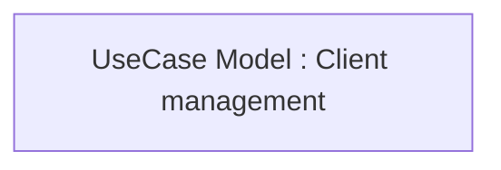

# CBL-11677 (CLM-3606) New Client Center application

- **Diagram Type**: Custom
- **Package**: HomerSelect/BSL/Requirements Model/Finished/CLM/CBL-11677 (CLM-3606) New Client Center application
- **Diagram ID**: 144774
- **Elements**: 1
- **Connectors**: 0

