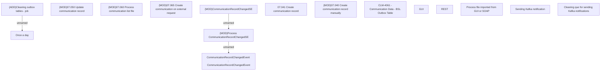

# CBL-11956 (CLM-4061 ) Complaints Data and Communication Data to Hadoop

```mermaid
graph TD
    ADD_Cleaning_outbox_tables_job["{ADD}Cleaning outbox tables - job"]
    Once_a_day["Once a day"]
    CommunicationRecordChangedEvent_CommunicationRecordChangedEv["CommunicationRecordChangedEvent : CommunicationRecordChangedEvent"]
    MOD_07_050_Update_communication_record["{MOD}07.050 Update communication record"]
    MOD_07_060_Process_communication_list_file["{MOD}07.060 Process communication list file"]
    MOD_07_065_Create_communication_on_external_request["{MOD}07.065 Create communication on external request"]
    MOD_Process_CommunicationRecordChangedSE["{MOD}Process CommunicationRecordChangedSE"]
    MOD_CommunicationRecordChangedSE["{MOD}CommunicationRecordChangedSE"]
    n_07_041_Create_communication_record["07.041 Create communication record"]
    MOD_07_040_Create_communication_record_manually["{MOD}07.040 Create communication record manually"]
    CLM_4061_Communication_Data_BSL_Outbox_Table["CLM-4061 - Communication Data - BSL Outbox Table"]
    GUI["GUI"]
    REST["REST"]
    Process_file_imported_from_GUI_or_SOAP["Process file imported from GUI or SOAP"]
    Sending_Kafka_notification["Sending Kafka notification"]
    Cleaning_que_for_sending_Kafka_notifications["Cleaning que for sending Kafka notifications"]
    MOD_CommunicationRecordChangedSE -->|unnamed| MOD_Process_CommunicationRecordChangedSE
    MOD_Process_CommunicationRecordChangedSE -->|unnamed| CommunicationRecordChangedEvent_CommunicationRecordChangedEv
    ADD_Cleaning_outbox_tables_job -->|unnamed| Once_a_day
```
