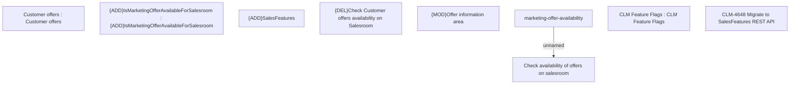

# CBL-12321 (CLM-4648) Migrate to SalesFeatures REST API

```mermaid
graph TD
    Customer_offers_Customer_offers["Customer offers : Customer offers"]
    ADD_IsMarketingOfferAvailableForSalesroom_ADD_IsMarketingOff["{ADD}IsMarketingOfferAvailableForSalesroom : {ADD}IsMarketingOfferAvailableForSalesroom"]
    ADD_SalesFeatures["{ADD}SalesFeatures"]
    DEL_Check_Customer_offers_availability_on_Salesroom["{DEL}Check Customer offers availability on Salesroom"]
    MOD_Offer_information_area["{MOD}Offer information area"]
    Check_availability_of_offers_on_salesroom["Check availability of offers on salesroom"]
    marketing_offer_availability["marketing-offer-availability"]
    CLM_Feature_Flags_CLM_Feature_Flags["CLM Feature Flags : CLM Feature Flags"]
    CLM_4648_Migrate_to_SalesFeatures_REST_API["CLM-4648 Migrate to SalesFeatures REST API"]
    marketing_offer_availability -->|unnamed| Check_availability_of_offers_on_salesroom
```
