# CBL-12580 (CLM-4090) Remove dependency on Debt Catalogue tables - services

- **Diagram Type**: Custom
- **Package**: HomerSelect/BSL/Requirements Model/Finished/CLM/CBL-12580 (CLM-4090) Remove dependency on Debt Catalogue tables - services
- **Diagram ID**: 144858
- **Elements**: 19
- **Connectors**: 0

```mermaid
graph TD
    ADD_getDebtCatalogueVector["{ADD}getDebtCatalogueVector"]
    ADD_getDebtCatalogues["{ADD}getDebtCatalogues"]
    ADD_getDebtCatalogue_contractCode["{ADD}getDebtCatalogue/{contractCode}"]
    ContractInformation["ContractInformation"]
    n_01_173_Get_contracts_for_cross_checks["01.173 Get contracts for cross checks"]
    MOD_01_754_Get_contract_detail["{MOD}01.754 Get contract detail"]
    MOD_01_771_Get_contracts_for_disbursement_service["{MOD}01.771 Get contracts for disbursement service"]
    RevolvingParameter["RevolvingParameter"]
    MOD_01_720_Reactivate_finished_contracts["{MOD}01.720 Reactivate finished contracts"]
    MOD_01_753_Get_contract_list["{MOD}01.753 Get contract list"]
    ContractFound["ContractFound"]
    CLM_4090_Remove_dependency_on_Debt_catalogue_tables_services["CLM-4090 - Remove dependency on Debt catalogue tables - services"]
    ContractWS_GetContractList["ContractWS.GetContractList"]
    ContractWS_GetContractForDisbursement["ContractWS.GetContractForDisbursement"]
    ContractWS_GetContractDetail["ContractWS.GetContractDetail"]
    ContractWS_GetContractsForCrossChecks["ContractWS.GetContractsForCrossChecks"]
    Reactivate_finished_contracts["Reactivate finished contracts"]
    Write_off_contracts["Write-off contracts"]
    Debt_catalogue_consumed_services["Debt catalogue consumed services"]
```

