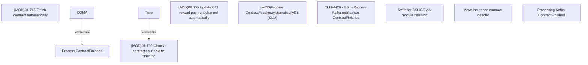

# CBL-12580 (CLM-4409) - BSL - Process Kafka notification ContractFinished

- **Diagram Type**: Custom
- **Package**: HomerSelect/BSL/Requirements Model/Finished/CLM/CBL-12580 (CLM-4409) - BSL - Process Kafka notification ContractFinished
- **Diagram ID**: 144983
- **Elements**: 11
- **Connectors**: 2

