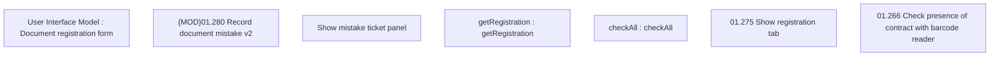

# CBL-12588 (CLM-2810) REM integration - Contract detail - Registration tab

```mermaid
graph TD
    User_Interface_Model_Document_registration_form["User Interface Model : Document registration form"]
    MOD_01_280_Record_document_mistake_v2["{MOD}01.280 Record document mistake v2"]
    Show_mistake_ticket_panel["Show mistake ticket panel"]
    getRegistration_getRegistration["getRegistration : getRegistration"]
    checkAll_checkAll["checkAll : checkAll"]
    n_01_275_Show_registration_tab["01.275 Show registration tab"]
    n_01_266_Check_presence_of_contract_with_barcode_reader["01.266 Check presence of contract with barcode reader"]
```
