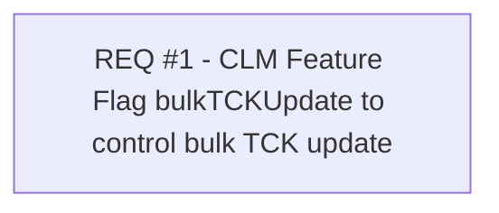

# CBL-12864 (CLM-3713) Registration queue - Consume and process RelatedSubjectNotification in COMA

- **Diagram Type**: Custom
- **Package**: HomerSelect/BSL/Requirements Model/Finished/CLM/CBL-12864 (CLM-3713) Registration queue - Consume and process RelatedSubjectNotification in COMA
- **Diagram ID**: 144893
- **Elements**: 1
- **Connectors**: 0

