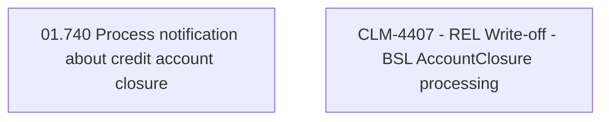

# CBL-1321 (CLM-4407) - REL Write-off - BSL AccountClosure processing

- **Diagram Type**: Custom
- **Package**: HomerSelect/BSL/Requirements Model/Finished/CLM/CBL-1321 (CLM-4407) - REL Write-off - BSL AccountClosure processing
- **Diagram ID**: 158911
- **Elements**: 2
- **Connectors**: 0

