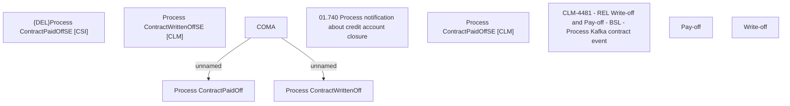

# CBL-1321 (CLM-4481) - REL Write-off & Pay-off - BSL - Process Kafka contract event

- **Diagram Type**: Custom
- **Package**: HomerSelect/BSL/Requirements Model/Finished/CLM/CBL-1321 (CLM-4481) - REL Write-off & Pay-off - BSL - Process Kafka contract event
- **Diagram ID**: 158914
- **Elements**: 10
- **Connectors**: 2

