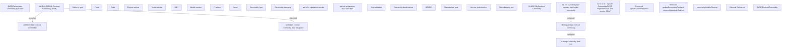

# CBL-13568 (CLM-4182) - Pagination for commodity search REST API

```mermaid
graph TD
    ADD_Get_contract_commodity_type_data["{ADD}Get contract commodity type data"]
    ADD_Get_contract_commodity_data_for_update["{ADD}Get contract commodity data for update"]
    ADD_01_650_Edit_Contract_Commodity_CLM["{ADD}01.650 Edit Contract Commodity [CLM]"]
    Getting_Commodity_data_rule["Getting Commodity data rule"]
    MOD_Validate_contract_commodity["{MOD}Validate contract commodity"]
    Delivery_type["Delivery type"]
    Price["Price"]
    Color["Color"]
    Engine_number["Engine number"]
    Serial_number["Serial number"]
    IMEI["IMEI"]
    Model_number["Model number"]
    Producer["Producer"]
    Name["Name"]
    Commodity_type["Commodity type"]
    Commodity_category["Commodity category"]
    Vehicle_registration_number["Vehicle registration number"]
    Vehicle_registration_expiration_date["Vehicle registration expiration date"]
    Skip_validation["Skip validation"]
    Ownership_book_number["Ownership book number"]
    MSISDN["MSISDN"]
    Manufacture_year["Manufacture year"]
    License_plate_number["License plate number"]
    Stock_keeping_unit["Stock keeping unit"]
    ADD_Update_contract_commodity["{ADD}Update contract commodity"]
    n_01_650_Edit_Contract_Commodity["01.650 Edit Contract Commodity"]
    n_01_331_Cancel_signed_contract_with_invalid_commodity["01.331 Cancel signed contract with invalid commodity"]
    CLM_4182_Update_Commodity_REST_implementation_and_remove_SOA["CLM-4182 - Update Commodity REST implementation and remove SOAP"]
    Removed_updateCommodityRest["Removed updateCommodityRest "]
    Removed_updateCommodityRest_commodityModuleCleanup["Removed updateCommodityRest and commodityModuleCleanup "]
    commodityModuleCleanup["commodityModuleCleanup "]
    External_Reference["External Reference"]
    MOD_ContractCommodity["{MOD}ContractCommodity"]
    n_01_331_Cancel_signed_contract_with_invalid_commodity -->|unnamed| MOD_Validate_contract_commodity
    ADD_01_650_Edit_Contract_Commodity_CLM -->|unnamed| ADD_Update_contract_commodity
    ADD_01_650_Edit_Contract_Commodity_CLM -->|unnamed| ADD_Get_contract_commodity_data_for_update
    MOD_Validate_contract_commodity -->|unnamed| Getting_Commodity_data_rule
```
