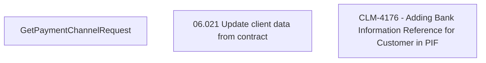

# CBL-13715 (CLM-4176) Adding Bank Information Reference for Customer in PIF

```mermaid
graph TD
    GetPaymentChannelRequest["GetPaymentChannelRequest"]
    n_06_021_Update_client_data_from_contract["06.021 Update client data from contract"]
    CLM_4176_Adding_Bank_Information_Reference_for_Customer_in_P["CLM-4176 - Adding Bank Information Reference for Customer in PIF"]
```
