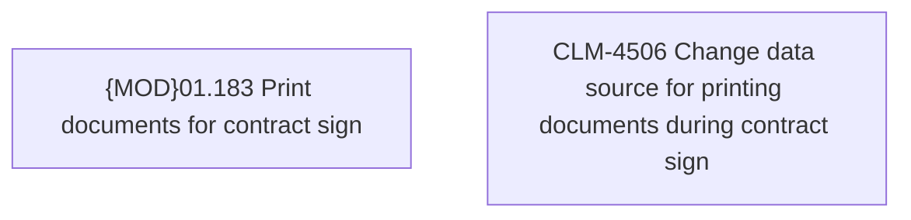

# CBL-13715 (CLM-4506) Change data source for printing documents during contract sign

- **Diagram Type**: Custom
- **Package**: HomerSelect/BSL/Requirements Model/Finished/CLM/CBL-13715 (CLM-4506) Change data source for printing documents during contract sign
- **Diagram ID**: 144895
- **Elements**: 2
- **Connectors**: 0

