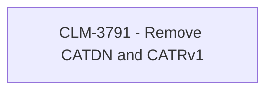

# CBL-14057 (CLM-3791) - Remove CATDN and CATRv1

- **Diagram Type**: Custom
- **Package**: HomerSelect/BSL/Requirements Model/Finished/CLM/CBL-14057 (CLM-3791) - Remove CATDN and CATRv1
- **Diagram ID**: 144909
- **Elements**: 1
- **Connectors**: 0

