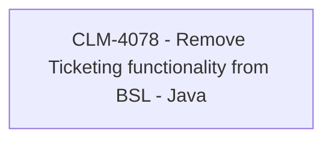

# CBL-14057 (CLM-4078) - Remove Ticketing functionality from BSL - Java

- **Diagram Type**: Custom
- **Package**: HomerSelect/BSL/Requirements Model/Finished/CLM/CBL-14057 (CLM-4078) - Remove Ticketing functionality from BSL - Java
- **Diagram ID**: 144916
- **Elements**: 1
- **Connectors**: 0

