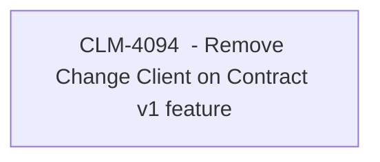

# CBL-14057 (CLM-4094) - Remove Change Client on Contract v1 feature

- **Diagram Type**: Custom
- **Package**: HomerSelect/BSL/Requirements Model/Finished/CLM/CBL-14057 (CLM-4094) - Remove Change Client on Contract v1 feature
- **Diagram ID**: 144910
- **Elements**: 1
- **Connectors**: 0

