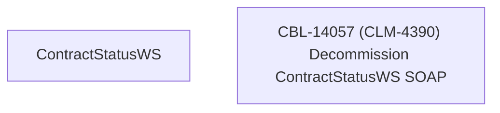

# CBL-14057 (CLM-4390) Decommission ContractStatusWS SOAP

- **Diagram Type**: Custom
- **Package**: HomerSelect/BSL/Requirements Model/Finished/CLM/CBL-14057 (CLM-4390) Decommission ContractStatusWS SOAP
- **Diagram ID**: 144867
- **Elements**: 2
- **Connectors**: 0

