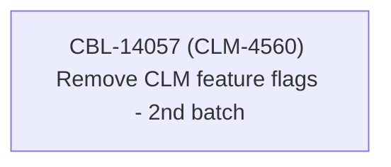

# CBL-14057 (CLM-4560) Remove CLM feature flags - 2nd batch

- **Diagram Type**: Custom
- **Package**: HomerSelect/BSL/Requirements Model/Finished/CLM/CBL-14057 (CLM-4560) Remove CLM feature flags - 2nd batch
- **Diagram ID**: 144915
- **Elements**: 1
- **Connectors**: 0

