# CBL-14151 (CLM-4863) - Migrate to AccountManagementWS v6

- **Diagram Type**: Custom
- **Package**: HomerSelect/BSL/Requirements Model/Finished/CLM/CBL-14151 (CLM-4863) - Migrate to AccountManagementWS v6
- **Diagram ID**: 145967
- **Elements**: 16
- **Connectors**: 0

```mermaid
graph TD
    AccountManagementWS_v6_AccountManagementWS_v6_CancelAccount["AccountManagementWS (v6) : AccountManagementWS (v6) - CancelAccount"]
    Creation_of_contract_cancellation_request_automatic_cancel["Creation of contract cancellation request - automatic cancel"]
    Creation_of_contract_cancellation_request_manual_cancel["Creation of contract cancellation request - manual cancel"]
    AccountManagementWS_v6_AccountManagementWS_v6_CancelTerminat["AccountManagementWS (v6) : AccountManagementWS (v6) - CancelTermination"]
    AccountManagementWS_v6_AccountManagementWS_v6_TerminateSimul["AccountManagementWS (v6) : AccountManagementWS (v6) - TerminateSimulation"]
    AccountManagementWS_v6_AccountManagementWS_v6_GetAccountBala["AccountManagementWS (v6) : AccountManagementWS (v6) - GetAccountBalance"]
    AccountManagementWS_v6_AccountManagementWS_v6_Terminate["AccountManagementWS (v6) : AccountManagementWS (v6) - Terminate"]
    n_01_172_Cancel_REL_contract_termination_request_manually["01.172 Cancel REL contract termination request manually"]
    n_01_171_Create_REL_contract_termination_request["01.171 Create REL contract termination request"]
    AccountManagementWS_v6_AccountManagementWS_v6_DoPayOff["AccountManagementWS (v6) : AccountManagementWS (v6) - DoPayOff"]
    n_01_410_Pay_off_contract_manually["01.410 Pay-off contract manually"]
    CLM_4863_Migrate_to_AccountManagementWS_v6["CLM-4863 - Migrate to AccountManagementWS v6"]
    Pay_off_contract["Pay-off contract"]
    Create_termination_request["Create termination request"]
    Cancel_termination_request["Cancel termination request"]
    Cancel_contract["Cancel contract"]
```

