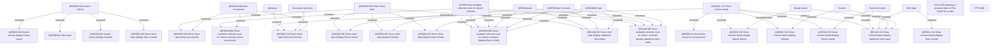

# CBL-14153 (CLM-4255) Masking of personal data on BSL CLM/CSI screens

```mermaid
graph TD
    Attributes["Attributes"]
    Document_attributes["Document attributes"]
    MOD_01_210_Show_client_data_show_documents["{MOD}01.210 Show client data (show documents)"]
    MOD_Identification_documents["{MOD}Identification documents"]
    MOD_Mask_client_data["{MOD}Mask client data"]
    ADD_06_040_Show_client_data_display_Date_of_birth["{ADD}06.040 Show client data (display Date of birth)"]
    ADD_06_040_Search_clients_display_Gender["{ADD}06.040 Search clients (display Gender)"]
    ADD_06_040_Search_clients_display_Parent_name["{ADD}06.040 Search clients (display Parent name)"]
    MOD_06_040_Search_Clients["{MOD}06.040 Search Clients"]
    MOD_06_030_Show_Client_Data["{MOD}06.030 Show Client Data"]
    ADD_08_900_Show_available_collection_tools_for_client_s_cont["{ADD}08.900 Show available collection tools for client's contracts (display Parent name)"]
    ADD_08_900_Show_available_collection_tools_for_client_s_cont["{ADD}08.900 Show available collection tools for client's contracts (display Gender)"]
    ADD_08_900_Show_available_collection_tools_for_client_s_cont["{ADD}08.900 Show available collection tools for client's contracts (display Date of birth)"]
    ADD_06_030_Show_client_data_display_Gender["{ADD}06.030 Show client data (display Gender)"]
    ADD_06_030_Show_client_data_display_Parent_name["{ADD}06.030 Show client data (display Parent name)"]
    ADD_06_030_Show_client_data_display_Date_of_birth["{ADD}06.030 Show client data (display Date of birth)"]
    ADD_01_210_Show_contract_detail_display_Marital_status["{ADD}01.210 Show contract detail (display Marital status)"]
    ADD_01_210_Show_contract_detail_display_Parent_name["{ADD}01.210 Show contract detail (display Parent name)"]
    ADD_01_210_Show_contract_detail_display_Gender["{ADD}01.210 Show contract detail (display Gender)"]
    ADD_01_210_Show_contract_detail_display_Date_of_birth["{ADD}01.210 Show contract detail (display Date of birth)"]
    MOD_08_900_Show_available_collection_tools_for_client_s_cont["{MOD}08.900 Show available collection tools for client's contracts (show documents)"]
    DEL_08_900_Show_available_collection_tools_for_client_s_cont["{DEL}08.900 Show available collection tools for client's contracts (display additional client data)"]
    n_08_900_Show_available_collection_tools_for_client_s_contra["08.900 Show available collection tools for client's contracts"]
    MOD_06_030_Show_client_data_show_documents["{MOD}06.030 Show client data (show documents)"]
    MOD_01_210_Show_contract_detail["{MOD}01.210 Show contract detail"]
    MOD_Show_documents_based_on_security_level["{MOD}Show documents based on security level"]
    MOD_Identification_documents["{MOD}Identification documents"]
    DEL_06_030_Show_client_data_display_additional_client_data["{DEL}06.030 Show client data (display additional client data)"]
    DEL_01_210_Show_contract_detail_display_additional_client_da["{DEL}01.210 Show contract detail (display additional client data)"]
    MOD_Gender["{MOD}Gender"]
    MOD_Birth_date["{MOD}Birth date"]
    MOD_Father_full_name["{MOD}Father full name"]
    Marital_status["Marital status"]
    Gender["Gender"]
    Birth_date["Birth date"]
    Parent_full_name["Parent full name"]
    CLM_4255_Masking_of_personal_data_on_BSL_CLM_CSI_screens["CLM-4255 Masking of personal data on BSL CLM/CSI screens"]
    TFT_4981["TFT-4981"]
    MOD_06_040_Search_Clients -->|unnamed| ADD_06_040_Show_client_data_display_Date_of_birth
    MOD_06_040_Search_Clients -->|unnamed| ADD_06_040_Search_clients_display_Gender
    MOD_06_040_Search_Clients -->|unnamed| MOD_Mask_client_data
    MOD_06_040_Search_Clients -->|unnamed| ADD_06_040_Search_clients_display_Parent_name
    MOD_06_030_Show_Client_Data -->|unnamed| DEL_06_030_Show_client_data_display_additional_client_data
    MOD_06_030_Show_Client_Data -->|unnamed| MOD_06_030_Show_client_data_show_documents
    MOD_06_030_Show_Client_Data -->|unnamed| ADD_06_030_Show_client_data_display_Gender
    MOD_06_030_Show_Client_Data -->|unnamed| ADD_06_030_Show_client_data_display_Date_of_birth
    MOD_06_030_Show_Client_Data -->|unnamed| ADD_06_030_Show_client_data_display_Parent_name
    MOD_01_210_Show_contract_detail -->|unnamed| ADD_01_210_Show_contract_detail_display_Gender
    MOD_01_210_Show_contract_detail -->|unnamed| MOD_01_210_Show_client_data_show_documents
    MOD_01_210_Show_contract_detail -->|unnamed| ADD_01_210_Show_contract_detail_display_Parent_name
    MOD_01_210_Show_contract_detail -->|unnamed| DEL_01_210_Show_contract_detail_display_additional_client_da
    MOD_01_210_Show_contract_detail -->|unnamed| ADD_01_210_Show_contract_detail_display_Marital_status
    MOD_01_210_Show_contract_detail -->|unnamed| MOD_Show_documents_based_on_security_level
    Attributes -->|unnamed| MOD_01_210_Show_client_data_show_documents
    Document_attributes -->|unnamed| MOD_01_210_Show_client_data_show_documents
    n_08_900_Show_available_collection_tools_for_client_s_contra -->|unnamed| ADD_08_900_Show_available_collection_tools_for_client_s_cont
    n_08_900_Show_available_collection_tools_for_client_s_contra -->|unnamed| ADD_08_900_Show_available_collection_tools_for_client_s_cont
    n_08_900_Show_available_collection_tools_for_client_s_contra -->|unnamed| ADD_08_900_Show_available_collection_tools_for_client_s_cont
    n_08_900_Show_available_collection_tools_for_client_s_contra -->|unnamed| MOD_08_900_Show_available_collection_tools_for_client_s_cont
    n_08_900_Show_available_collection_tools_for_client_s_contra -->|unnamed| DEL_08_900_Show_available_collection_tools_for_client_s_cont
    Parent_full_name -->|unnamed| DEL_01_210_Show_contract_detail_display_additional_client_da
    Parent_full_name -->|unnamed| ADD_01_210_Show_contract_detail_display_Parent_name
    Birth_date -->|unnamed| DEL_01_210_Show_contract_detail_display_additional_client_da
    Birth_date -->|unnamed| ADD_01_210_Show_contract_detail_display_Date_of_birth
    MOD_Identification_documents -->|unnamed| MOD_01_210_Show_client_data_show_documents
    Gender -->|unnamed| DEL_01_210_Show_contract_detail_display_additional_client_da
    Gender -->|unnamed| ADD_01_210_Show_contract_detail_display_Gender
    Marital_status -->|unnamed| DEL_01_210_Show_contract_detail_display_additional_client_da
    Marital_status -->|unnamed| ADD_01_210_Show_contract_detail_display_Marital_status
    MOD_Gender -->|unnamed| ADD_06_030_Show_client_data_display_Gender
    MOD_Gender -->|unnamed| DEL_08_900_Show_available_collection_tools_for_client_s_cont
    MOD_Gender -->|unnamed| DEL_06_030_Show_client_data_display_additional_client_data
    MOD_Gender -->|unnamed| ADD_08_900_Show_available_collection_tools_for_client_s_cont
    MOD_Father_full_name -->|unnamed| ADD_06_030_Show_client_data_display_Parent_name
    MOD_Father_full_name -->|unnamed| ADD_08_900_Show_available_collection_tools_for_client_s_cont
    MOD_Father_full_name -->|unnamed| DEL_06_030_Show_client_data_display_additional_client_data
    MOD_Father_full_name -->|unnamed| DEL_08_900_Show_available_collection_tools_for_client_s_cont
    MOD_Identification_documents -->|unnamed| MOD_06_030_Show_client_data_show_documents
    MOD_Identification_documents -->|unnamed| MOD_08_900_Show_available_collection_tools_for_client_s_cont
    MOD_Birth_date -->|unnamed| DEL_08_900_Show_available_collection_tools_for_client_s_cont
    MOD_Birth_date -->|unnamed| DEL_06_030_Show_client_data_display_additional_client_data
    MOD_Birth_date -->|unnamed| ADD_06_030_Show_client_data_display_Date_of_birth
    MOD_Birth_date -->|unnamed| ADD_08_900_Show_available_collection_tools_for_client_s_cont
```
