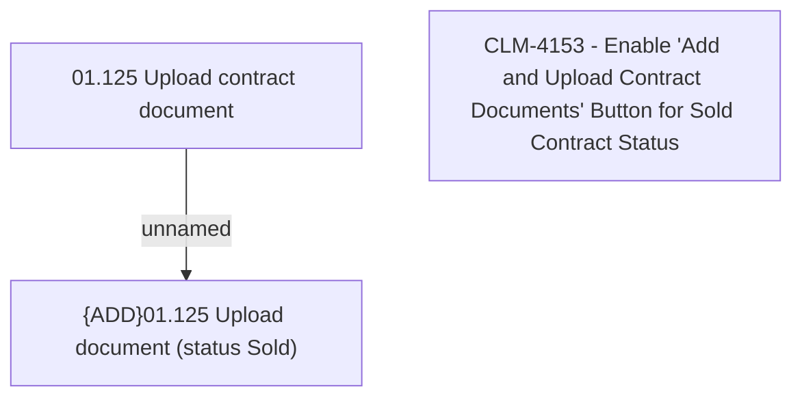

# CBL-14203 (CLM-4153) Enable "Add and Upload Contract Documents"

```mermaid
graph TD
    ADD_01_125_Upload_document_status_Sold["{ADD}01.125 Upload document (status Sold)"]
    n_01_125_Upload_contract_document["01.125 Upload contract document"]
    CLM_4153_Enable_Add_and_Upload_Contract_Documents_Button_for["CLM-4153 - Enable 'Add and Upload Contract Documents' Button for Sold Contract Status"]
    n_01_125_Upload_contract_document -->|unnamed| ADD_01_125_Upload_document_status_Sold
```
