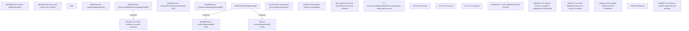

# CBL-14504 (CLM-5127) Asynchronous contract activation

```mermaid
graph TD
    MOD_08_252_Process_cooling_off_period["{MOD}08.252 Process cooling-off period"]
    MOD_08_280_Check_and_process_CET_request["{MOD}08.280 Check and process CET request"]
    el_1816722["Note"]
    MOD_Process_ContractRegistrationSE["{MOD}Process ContractRegistrationSE"]
    ADD_Process_CELAccountBalanceChangedInternalSE["{ADD}Process CELAccountBalanceChangedInternalSE"]
    MOD_Process_ContractFinishingAutomaticallySE_CSI["{MOD}Process ContractFinishingAutomaticallySE [CSI]"]
    MOD_Process_LoanServiceRequestExecutedSE["{MOD}Process LoanServiceRequestExecutedSE"]
    MOD_ContractRegisteredSE["{MOD}ContractRegisteredSE"]
    MOD_Process_ContractRegisteredSE_PAY["{MOD}Process ContractRegisteredSE [PAY]"]
    Process_ContractRegisteredSE_CLM["Process ContractRegisteredSE [CLM]"]
    n_03_100_Check_and_process_Early_repayment_request["03.100 Check and process Early repayment request"]
    MOD_01_384_Finalize_contract_consolidation["{MOD}01.384 Finalize contract consolidation"]
    CBL_14504_CLM_5127_Asynchronous_contract_activation["CBL-14504 (CLM-5127) Asynchronous contract activation"]
    FF_finishContractBasedOnABCForLoanServices_dead_code_removal["FF finishContractBasedOnABCForLoanServices dead code removal"]
    UC01_714_removal["UC01.714 removal"]
    UC01_712_removal["UC01.712 removal"]
    UC_01_713_removal["UC 01.713 removal"]
    CONTRACT_AUTO_REGISTRATION_removal["CONTRACT_AUTO_REGISTRATION  removal"]
    DEL_01_712_Finish_contract_on_service_execution["{DEL}01.712 Finish contract on service execution"]
    MOD_01_279_Choose_contracts_suitable_to_registration_and_fin["{MOD}01.279 Choose contracts suitable to registration and finishing"]
    DEL_01_713_Finish_registered_contract_on_service_execution["{DEL}01.713 Finish registered contract on service execution"]
    DEL_01_252_Evaluate_Contract_Service_Parameters["{DEL}01.252 Evaluate Contract Service Parameters"]
    External_Reference["External Reference"]
    MOD_01_714_Process_contract_registering_and_finishing["{MOD}01.714 Process contract registering and finishing"]
    MOD_ContractRegisteredSE -->|unnamed| MOD_Process_ContractRegisteredSE_PAY
    MOD_ContractRegisteredSE -->|unnamed| Process_ContractRegisteredSE_CLM
    ADD_Process_CELAccountBalanceChangedInternalSE -->|unnamed| DEL_01_712_Finish_contract_on_service_execution
```
