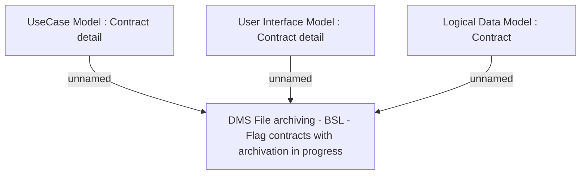

# CBL-14638

```mermaid
graph TD
    UseCase_Model_Contract_detail["UseCase Model : Contract detail"]
    User_Interface_Model_Contract_detail["User Interface Model : Contract detail"]
    Logical_Data_Model_Contract["Logical Data Model : Contract"]
    DMS_File_archiving_BSL_Flag_contracts_with_archivation_in_pr[" DMS File archiving - BSL - Flag contracts with archivation in progress"]
    UseCase_Model_Contract_detail -->|unnamed| DMS_File_archiving_BSL_Flag_contracts_with_archivation_in_pr
    User_Interface_Model_Contract_detail -->|unnamed| DMS_File_archiving_BSL_Flag_contracts_with_archivation_in_pr
    Logical_Data_Model_Contract -->|unnamed| DMS_File_archiving_BSL_Flag_contracts_with_archivation_in_pr
```
