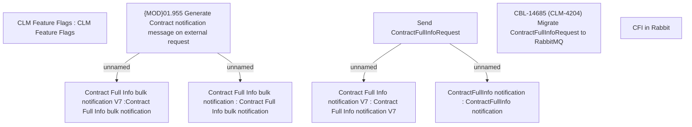

# CBL-14685 (CLM-4204) Migrate ContractFullInfoRequest to RabbitMQ

```mermaid
graph TD
    Contract_Full_Info_bulk_notification_Contract_Full_Info_bulk["Contract Full Info bulk notification : Contract Full Info bulk notification"]
    ContractFullInfo_notification_ContractFullInfo_notification["ContractFullInfo notification : ContractFullInfo notification"]
    Contract_Full_Info_bulk_notification_V7_Contract_Full_Info_b["Contract Full Info bulk notification V7 :Contract Full Info bulk notification"]
    Contract_Full_Info_notification_V7_Contract_Full_Info_notifi["Contract Full Info notification V7 : Contract Full Info notification V7"]
    CLM_Feature_Flags_CLM_Feature_Flags["CLM Feature Flags : CLM Feature Flags"]
    MOD_01_955_Generate_Contract_notification_message_on_externa["{MOD}01.955 Generate Contract notification message on external request"]
    Send_ContractFullInfoRequest["Send ContractFullInfoRequest"]
    CBL_14685_CLM_4204_Migrate_ContractFullInfoRequest_to_Rabbit["CBL-14685 (CLM-4204) Migrate ContractFullInfoRequest to RabbitMQ"]
    CFI_in_Rabbit["CFI in Rabbit"]
    Send_ContractFullInfoRequest -->|unnamed| Contract_Full_Info_notification_V7_Contract_Full_Info_notifi
    Send_ContractFullInfoRequest -->|unnamed| ContractFullInfo_notification_ContractFullInfo_notification
    MOD_01_955_Generate_Contract_notification_message_on_externa -->|unnamed| Contract_Full_Info_bulk_notification_V7_Contract_Full_Info_b
    MOD_01_955_Generate_Contract_notification_message_on_externa -->|unnamed| Contract_Full_Info_bulk_notification_Contract_Full_Info_bulk
```
