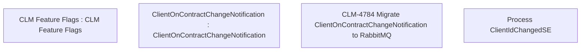

# CBL-14688 (CLM-4784) Migrate ClientOnContractChangeNotification to RabbitMQ

- **Diagram Type**: Custom
- **Package**: HomerSelect/BSL/Requirements Model/Finished/CLM/CBL-14688 (CLM-4784) Migrate ClientOnContractChangeNotification to RabbitMQ
- **Diagram ID**: 147436
- **Elements**: 5
- **Connectors**: 0

