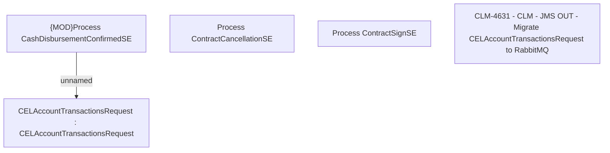

# CBL-14692 (CLM-4631) - CLM - JMS OUT - Migrate CELAccountTransactionsRequest to RabbitMQ

- **Diagram Type**: Custom
- **Package**: HomerSelect/BSL/Requirements Model/Finished/CLM/CBL-14692 (CLM-4631) - CLM - JMS OUT - Migrate CELAccountTransactionsRequest to RabbitMQ
- **Diagram ID**: 144927
- **Elements**: 5
- **Connectors**: 1

