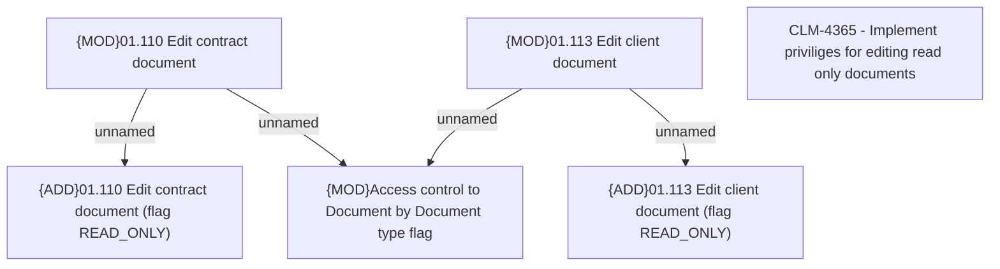

# CBL-14919 NATIONAL ID as new primary ID in PH

- **Diagram Type**: Custom
- **Package**: HomerSelect/BSL/Requirements Model/Finished/CLM/CBL-14919 NATIONAL ID as new primary ID in PH
- **Diagram ID**: 144871
- **Elements**: 6
- **Connectors**: 4

