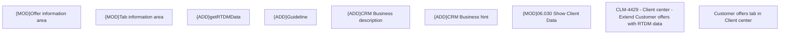

# CBL-15196 (CLM-4429) Client center - Extend Customer offers with RTDM data

```mermaid
graph TD
    MOD_Offer_information_area["{MOD}Offer information area"]
    MOD_Tab_information_area["{MOD}Tab information area"]
    ADD_getRTDMData["{ADD}getRTDMData"]
    ADD_Guideline["{ADD}Guideline"]
    ADD_CRM_Business_description["{ADD}CRM Business description"]
    ADD_CRM_Business_hint["{ADD}CRM Business hint"]
    MOD_06_030_Show_Client_Data["{MOD}06.030 Show Client Data"]
    CLM_4429_Client_center_Extend_Customer_offers_with_RTDM_data["CLM-4429 - Client center - Extend Customer offers with RTDM data"]
    Customer_offers_tab_in_Client_center["Customer offers tab in Client center"]
```
