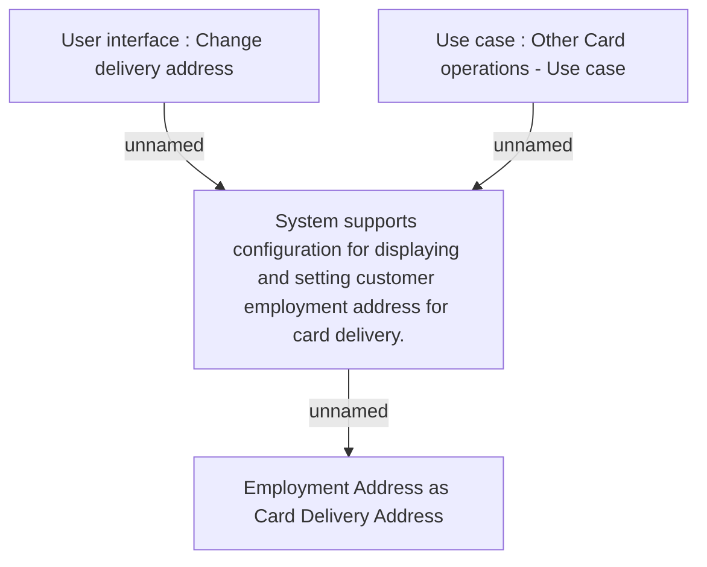

# CBL-1522 (CLM-876) Employment Address as Card Delivery Address

```mermaid
graph TD
    User_interface_Change_delivery_address["User interface : Change delivery address"]
    Use_case_Other_Card_operations_Use_case["Use case : Other Card operations - Use case"]
    System_supports_configuration_for_displaying_and_setting_cus["System supports configuration for displaying and setting customer employment address for card delivery."]
    Employment_Address_as_Card_Delivery_Address["Employment Address as Card Delivery Address"]
    System_supports_configuration_for_displaying_and_setting_cus -->|unnamed| Employment_Address_as_Card_Delivery_Address
    User_interface_Change_delivery_address -->|unnamed| System_supports_configuration_for_displaying_and_setting_cus
    Use_case_Other_Card_operations_Use_case -->|unnamed| System_supports_configuration_for_displaying_and_setting_cus
```
