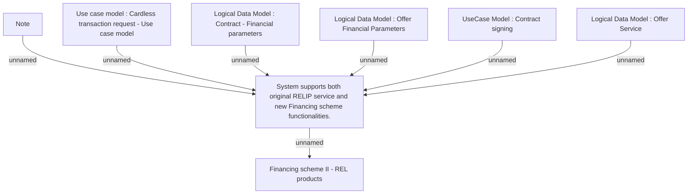

# CBL-1533 (CLM-1063) Financing scheme II - REL products

- **Diagram Type**: Custom
- **Package**: HomerSelect/BSL/Requirements Model/Finished/CLM/CBL-1533 (CLM-1063) Financing scheme II - REL products
- **Diagram ID**: 158896
- **Elements**: 8
- **Connectors**: 7

