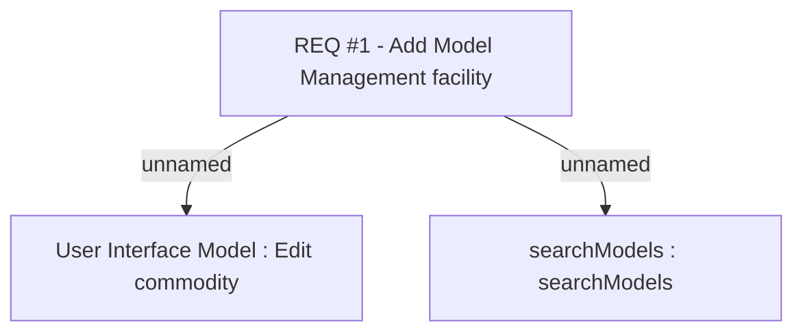

# CBL-15437 (CLM-4455) BSL: Add Model Management facility

```mermaid
graph TD
    searchModels_searchModels["searchModels : searchModels"]
    User_Interface_Model_Edit_commodity["User Interface Model : Edit commodity"]
    REQ_1_Add_Model_Management_facility["REQ #1 - Add Model Management facility "]
    REQ_1_Add_Model_Management_facility -->|unnamed| User_Interface_Model_Edit_commodity
    REQ_1_Add_Model_Management_facility -->|unnamed| searchModels_searchModels
```
