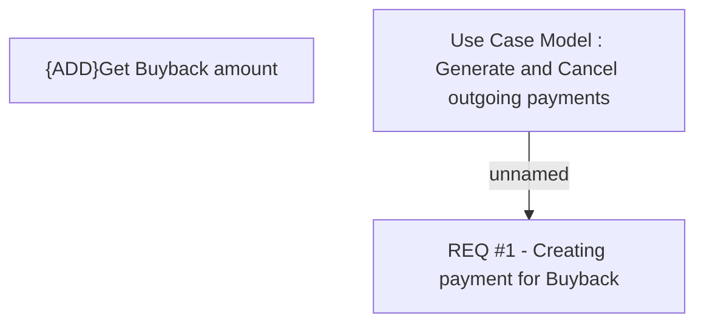

# CBL-1548 (CLM-936) Buyback Phase 1

- **Diagram Type**: Custom
- **Package**: HomerSelect/BSL/Requirements Model/Finished/CLM/CBL-1548 (CLM-936) Buyback Phase 1
- **Diagram ID**: 158900
- **Elements**: 3
- **Connectors**: 1

