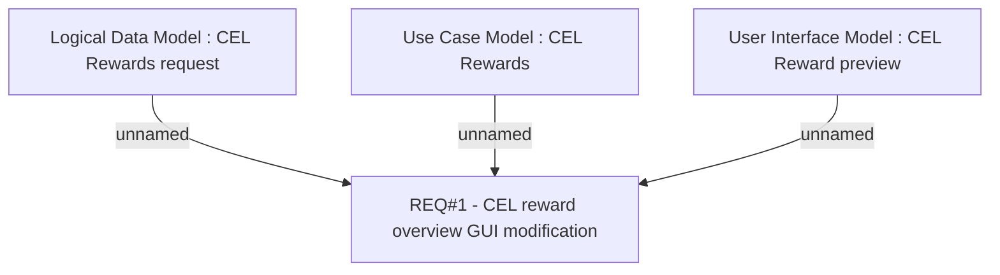

# CBL-1559 (CLM-955) CEL Rewards for KZ

```mermaid
graph TD
    Logical_Data_Model_CEL_Rewards_request["Logical Data Model : CEL Rewards request"]
    Use_Case_Model_CEL_Rewards["Use Case Model : CEL Rewards "]
    REQ_1_CEL_reward_overview_GUI_modification["REQ#1 - CEL reward overview GUI modification"]
    User_Interface_Model_CEL_Reward_preview["User Interface Model : CEL Reward preview"]
    Logical_Data_Model_CEL_Rewards_request -->|unnamed| REQ_1_CEL_reward_overview_GUI_modification
    Use_Case_Model_CEL_Rewards -->|unnamed| REQ_1_CEL_reward_overview_GUI_modification
    User_Interface_Model_CEL_Reward_preview -->|unnamed| REQ_1_CEL_reward_overview_GUI_modification
```
