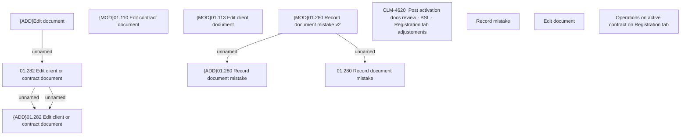

# CBL-16401 (CLM-4620) Post activation docs review - BSL - Registration tab adjustements

- **Diagram Type**: Custom
- **Package**: HomerSelect/BSL/Requirements Model/Finished/CLM/CBL-16401 (CLM-4620) Post activation docs review - BSL - Registration tab adjustements
- **Diagram ID**: 144919
- **Elements**: 13
- **Connectors**: 5

