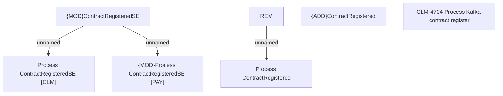

# CBL-16401 (CLM-4704) - Process Kafka contract register

- **Diagram Type**: Custom
- **Package**: HomerSelect/BSL/Requirements Model/Finished/CLM/CBL-16401 (CLM-4704) - Process Kafka contract register
- **Diagram ID**: 147062
- **Elements**: 7
- **Connectors**: 3

