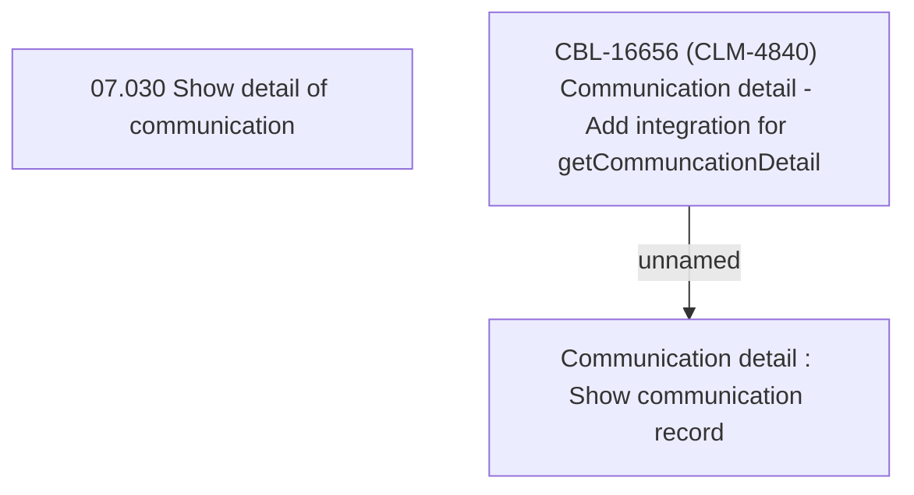

# CBL-16656 (CLM-4840) Communication detail - Add integration for getCommuncationDetail

- **Diagram Type**: Custom
- **Package**: HomerSelect/BSL/Requirements Model/Finished/CLM/CBL-16656 (CLM-4840) Communication detail - Add integration for getCommuncationDetail
- **Diagram ID**: 147473
- **Elements**: 3
- **Connectors**: 1

