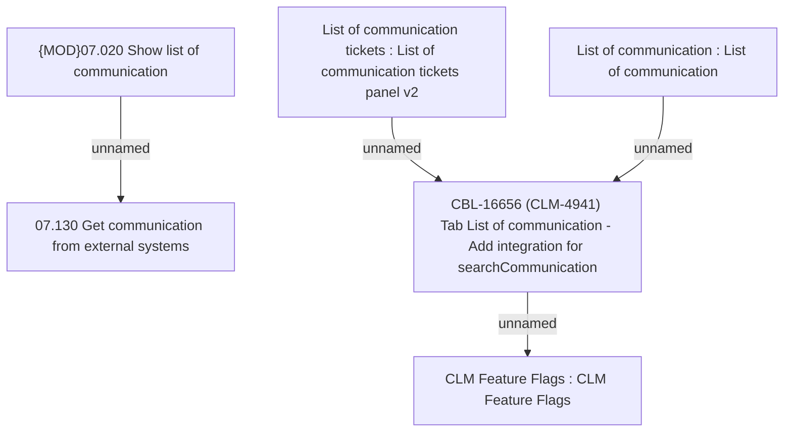

# CBL-16656 (CLM-4941) Tab List of communication - Add integration for searchCommunication

- **Diagram Type**: Custom
- **Package**: HomerSelect/BSL/Requirements Model/Finished/CLM/CBL-16656 (CLM-4941) Tab List of communication - Add integration for searchCommunication
- **Diagram ID**: 147474
- **Elements**: 6
- **Connectors**: 4

