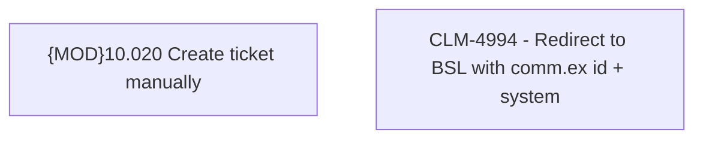

# CBL-16656 (CLM-4994) - Redirect to BSL with comm.ex id + system

- **Diagram Type**: Custom
- **Package**: HomerSelect/BSL/Requirements Model/Finished/CLM/CBL-16656 (CLM-4994) - Redirect to BSL with comm.ex id + system
- **Diagram ID**: 158915
- **Elements**: 2
- **Connectors**: 0

