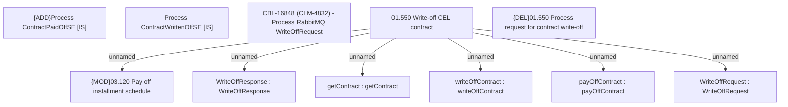

# CBL-16848 (CLM-4832) - Process RabbitMQ WriteOffRequest

```mermaid
graph TD
    ADD_Process_ContractPaidOffSE_IS["{ADD}Process ContractPaidOffSE [IS]"]
    Process_ContractWrittenOffSE_IS["Process ContractWrittenOffSE [IS]"]
    MOD_03_120_Pay_off_installment_schedule["{MOD}03.120 Pay off installment schedule"]
    writeOffContract_writeOffContract["writeOffContract : writeOffContract"]
    payOffContract_payOffContract["payOffContract : payOffContract"]
    getContract_getContract["getContract  : getContract"]
    WriteOffResponse_WriteOffResponse["WriteOffResponse : WriteOffResponse"]
    WriteOffRequest_WriteOffRequest["WriteOffRequest : WriteOffRequest"]
    CBL_16848_CLM_4832_Process_RabbitMQ_WriteOffRequest["CBL-16848 (CLM-4832) - Process RabbitMQ WriteOffRequest"]
    n_01_550_Write_off_CEL_contract["01.550 Write-off CEL contract"]
    DEL_01_550_Process_request_for_contract_write_off["{DEL}01.550 Process request for contract write-off "]
    n_01_550_Write_off_CEL_contract -->|unnamed| MOD_03_120_Pay_off_installment_schedule
    n_01_550_Write_off_CEL_contract -->|unnamed| WriteOffResponse_WriteOffResponse
    n_01_550_Write_off_CEL_contract -->|unnamed| getContract_getContract
    n_01_550_Write_off_CEL_contract -->|unnamed| writeOffContract_writeOffContract
    n_01_550_Write_off_CEL_contract -->|unnamed| payOffContract_payOffContract
    n_01_550_Write_off_CEL_contract -->|unnamed| WriteOffRequest_WriteOffRequest
```
