# CBL-1686 (CLM-961) Repeated POS

- **Diagram Type**: Custom
- **Package**: HomerSelect/BSL/Requirements Model/Finished/CLM/CBL-1686 (CLM-961) Repeated POS
- **Diagram ID**: 158897
- **Elements**: 10
- **Connectors**: 0

```mermaid
graph TD
    GetCodeList_CustomerOfferWS_GetCodeList["GetCodeList : CustomerOfferWS - GetCodeList"]
    Use_case_model_Cardless_transaction_request_Use_case_model["Use case model : Cardless transaction request - Use case model"]
    User_Interface_Model_Cardless_POS_transaction_request_User_I["User Interface Model : Cardless POS transaction request - User Interface"]
    OneTimePasswordWS_OneTimePasswordWS_overview["OneTimePasswordWS : OneTimePasswordWS (overview)"]
    Logical_data_model_Account_transaction_Logical_data_model["Logical data model : Account transaction - Logical data model"]
    REQ_1_Creation_a_request_for_cardless_POS_transaction["REQ #1 - Creation a request for cardless POS transaction"]
    CreateCommodityData_CreateCommodityData["CreateCommodityData : CreateCommodityData"]
    ValidateCommodityData_ValidateCommodityData["ValidateCommodityData : ValidateCommodityData"]
    User_Interface_Model_Edit_commodity["User Interface Model : Edit commodity"]
    el_1826181["Note"]
```

