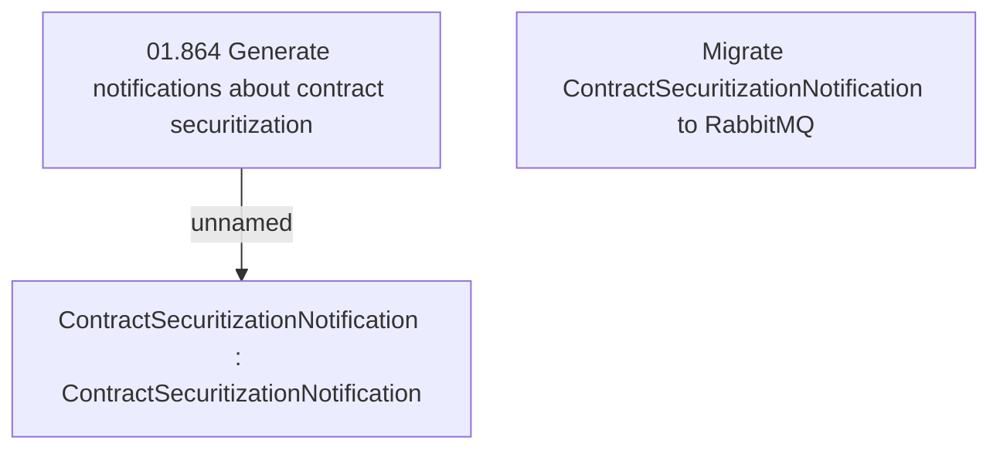

# CBL-17134 (CLM-4785) Migrate ContractSecuritizationNotification to RabbitMQ

- **Diagram Type**: Custom
- **Package**: HomerSelect/BSL/Requirements Model/Finished/CLM/CBL-17134 (CLM-4785) Migrate ContractSecuritizationNotification to RabbitMQ
- **Diagram ID**: 158913
- **Elements**: 3
- **Connectors**: 1

