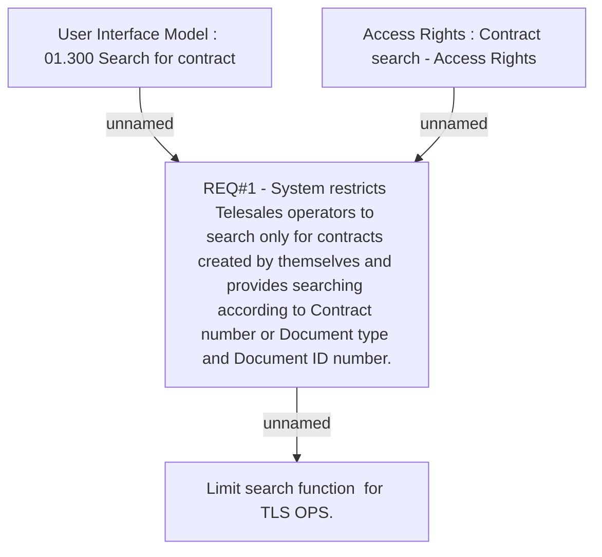

# CBL-1724 (CLM-978) Limit search function for TLS OPS

```mermaid
graph TD
    User_Interface_Model_01_300_Search_for_contract["User Interface Model : 01.300 Search for contract"]
    Access_Rights_Contract_search_Access_Rights["Access Rights : Contract search - Access Rights"]
    REQ_1_System_restricts_Telesales_operators_to_search_only_fo["REQ#1 - System restricts Telesales operators to search only for contracts created by themselves and provides searching according to Contract number or Document type and Document ID number."]
    Limit_search_function_for_TLS_OPS["Limit search function  for TLS OPS."]
    REQ_1_System_restricts_Telesales_operators_to_search_only_fo -->|unnamed| Limit_search_function_for_TLS_OPS
    User_Interface_Model_01_300_Search_for_contract -->|unnamed| REQ_1_System_restricts_Telesales_operators_to_search_only_fo
    Access_Rights_Contract_search_Access_Rights -->|unnamed| REQ_1_System_restricts_Telesales_operators_to_search_only_fo
```
