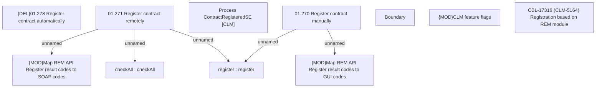

# CBL-17316 (CLM-5164) Registration based on REM module

- **Diagram Type**: Custom
- **Package**: HomerSelect/BSL/Requirements Model/Finished/CLM/CBL-17316 (CLM-5164) Registration based on REM module
- **Diagram ID**: 149306
- **Elements**: 11
- **Connectors**: 5

