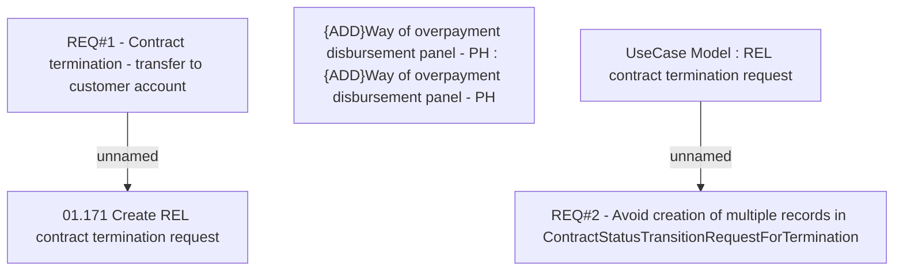

# CBL-175 (CLM-976) Contract termination - transfer to customer account

```mermaid
graph TD
    REQ_1_Contract_termination_transfer_to_customer_account["REQ#1 - Contract termination - transfer to customer account"]
    ADD_Way_of_overpayment_disbursement_panel_PH_ADD_Way_of_over["{ADD}Way of overpayment disbursement panel - PH : {ADD}Way of overpayment disbursement panel - PH"]
    n_01_171_Create_REL_contract_termination_request["01.171 Create REL contract termination request"]
    REQ_2_Avoid_creation_of_multiple_records_in_ContractStatusTr["REQ#2 - Avoid creation of multiple records in ContractStatusTransitionRequestForTermination"]
    UseCase_Model_REL_contract_termination_request["UseCase Model : REL contract termination request"]
    UseCase_Model_REL_contract_termination_request -->|unnamed| REQ_2_Avoid_creation_of_multiple_records_in_ContractStatusTr
    REQ_1_Contract_termination_transfer_to_customer_account -->|unnamed| n_01_171_Create_REL_contract_termination_request
```
