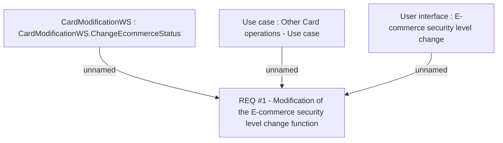

# CBL-1750 (CLM-922) Adding note when changing ecommerce status

```mermaid
graph TD
    User_interface_E_commerce_security_level_change["User interface : E-commerce security level change"]
    Use_case_Other_Card_operations_Use_case["Use case : Other Card operations - Use case"]
    CardModificationWS_CardModificationWS_ChangeEcommerceStatus["CardModificationWS : CardModificationWS.ChangeEcommerceStatus"]
    REQ_1_Modification_of_the_E_commerce_security_level_change_f["REQ #1 - Modification of the E-commerce security level change function"]
    CardModificationWS_CardModificationWS_ChangeEcommerceStatus -->|unnamed| REQ_1_Modification_of_the_E_commerce_security_level_change_f
    Use_case_Other_Card_operations_Use_case -->|unnamed| REQ_1_Modification_of_the_E_commerce_security_level_change_f
    User_interface_E_commerce_security_level_change -->|unnamed| REQ_1_Modification_of_the_E_commerce_security_level_change_f
```
