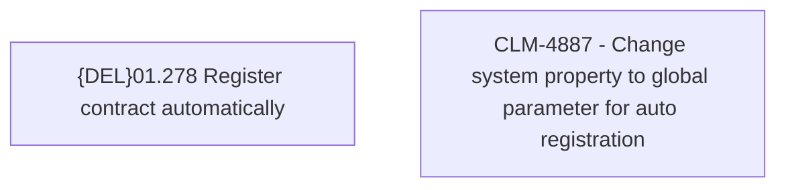

# CBL-17830 (CLM-4887) - Turn off REL Auto Registration on C1 and PreProd

- **Diagram Type**: Custom
- **Package**: HomerSelect/BSL/Requirements Model/Finished/CLM/CBL-17830 (CLM-4887) - Turn off REL Auto Registration on C1 and PreProd
- **Diagram ID**: 146080
- **Elements**: 2
- **Connectors**: 0

