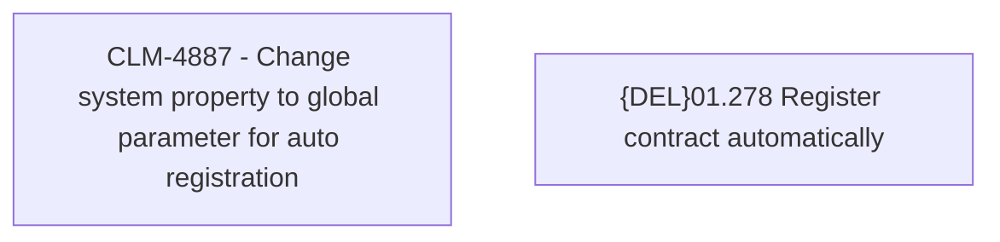

# CBL-17830 (CLM-4887) - Turn off REL Auto Registration on C1 and PreProd

```mermaid
graph TD
    CLM_4887_Change_system_property_to_global_parameter_for_auto["CLM-4887 - Change system property to global parameter for auto registration"]
    DEL_01_278_Register_contract_automatically["{DEL}01.278 Register contract automatically"]
```
