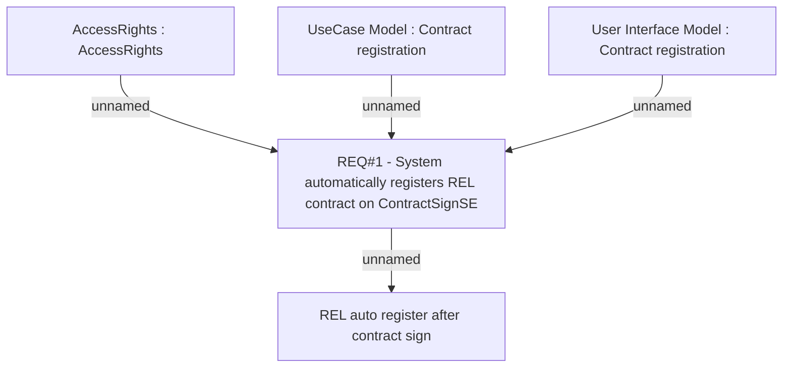

# CBL-1790 (CLM-938) REL auto Register after Sign Contract

```mermaid
graph TD
    AccessRights_AccessRights["AccessRights : AccessRights"]
    UseCase_Model_Contract_registration["UseCase Model : Contract registration"]
    User_Interface_Model_Contract_registration["User Interface Model : Contract registration"]
    REQ_1_System_automatically_registers_REL_contract_on_Contrac["REQ#1 - System automatically registers REL contract on ContractSignSE"]
    REL_auto_register_after_contract_sign["REL auto register after contract sign"]
    REQ_1_System_automatically_registers_REL_contract_on_Contrac -->|unnamed| REL_auto_register_after_contract_sign
    AccessRights_AccessRights -->|unnamed| REQ_1_System_automatically_registers_REL_contract_on_Contrac
    UseCase_Model_Contract_registration -->|unnamed| REQ_1_System_automatically_registers_REL_contract_on_Contrac
    User_Interface_Model_Contract_registration -->|unnamed| REQ_1_System_automatically_registers_REL_contract_on_Contrac
```
