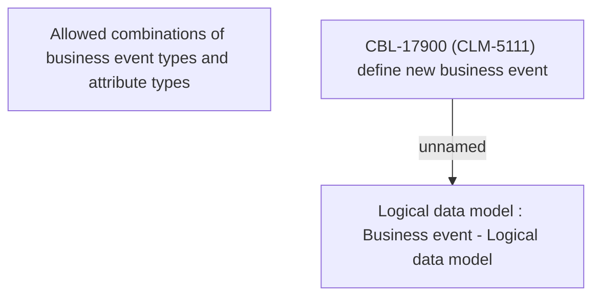

# CBL-17900 (CLM-5111) define new business event

- **Diagram Type**: Custom
- **Package**: HomerSelect/BSL/Requirements Model/Finished/CLM/CBL-17900 (CLM-5111) define new business event
- **Diagram ID**: 148193
- **Elements**: 3
- **Connectors**: 1

