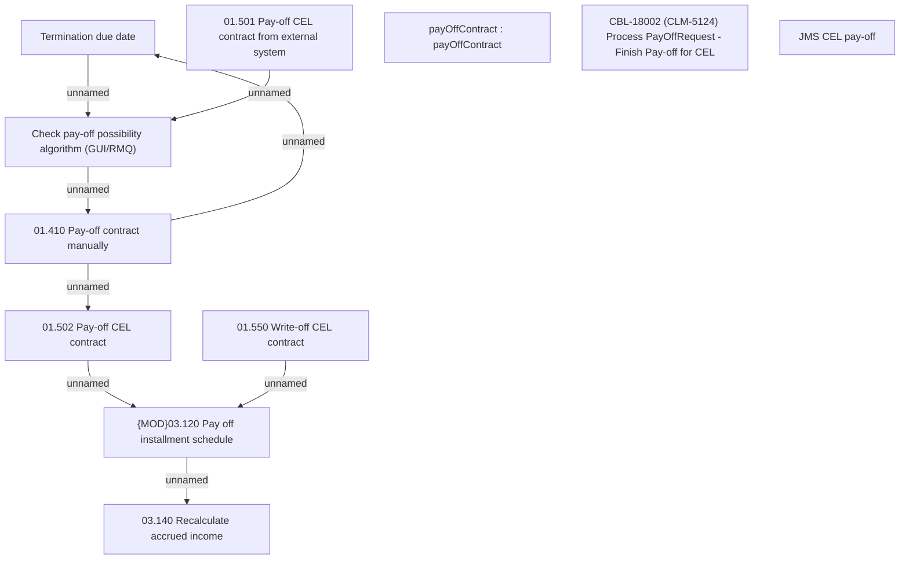

# CBL-18002 (CLM-5124) Process PayOffRequest - Finish Pay-off for CEL

- **Diagram Type**: Custom
- **Package**: HomerSelect/BSL/Requirements Model/Finished/CLM/CBL-18002 (CLM-5124) Process PayOffRequest - Finish Pay-off for CEL
- **Diagram ID**: 148814
- **Elements**: 11
- **Connectors**: 8

