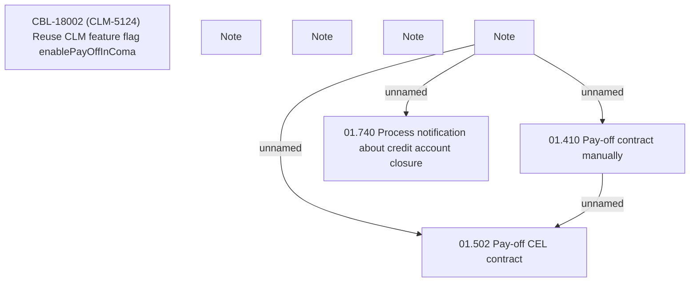

# CBL-18002 (CLM-5124) Reuse CLM feature flag enablePayOffInComa

```mermaid
graph TD
    n_01_410_Pay_off_contract_manually["01.410 Pay-off contract manually"]
    n_01_502_Pay_off_CEL_contract["01.502 Pay-off CEL contract"]
    n_01_740_Process_notification_about_credit_account_closure["01.740 Process notification about credit account closure "]
    CBL_18002_CLM_5124_Reuse_CLM_feature_flag_enablePayOffInComa["CBL-18002 (CLM-5124) Reuse CLM feature flag enablePayOffInComa"]
    el_1727586["Note"]
    el_1727583["Note"]
    el_1727582["Note"]
    el_1727584["Note"]
    el_1727584 -->|unnamed| n_01_410_Pay_off_contract_manually
    el_1727584 -->|unnamed| n_01_502_Pay_off_CEL_contract
    el_1727584 -->|unnamed| n_01_740_Process_notification_about_credit_account_closure
    n_01_410_Pay_off_contract_manually -->|unnamed| n_01_502_Pay_off_CEL_contract
```
